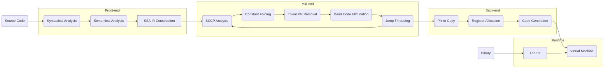

  

  <a href="https://felys.dev/quickstart">Quickstart</a> |
  <a href="https://felys.dev/">Documentation</a> |
  <a href="https://exec.felys.dev/">Playground</a>

## What is the Felys Programming Language?

Felys is a dependency-free interpreted programming language written in Rust, featuring its own compiler and runtime. Feel free to try it out in the online [playground](https://exec.felys.dev/). Please note, however, that the language is currently in a fragile state following a major reconstruction and requires project-level refactoring to improve code quality.

## Components

- [PhiLia093](felys/src/philia093): Parser and a general-purpose [generator](philia093) with self-bootstrapping capabilities
- [Cyrene](felys/src/cyrene): Control-flow graph builder and transformer for intermediate representation
- [Demiurge](felys/src/demiurge): Dead code elimination, register allocation, and code generation
- [Elysia](felys/src/elysia): Execution runtime, featuring a neural network library and bytecode loader/dumper

The design is simple, but still, here's the high-level pipeline:

## License

Distributed under the terms of the [LICENSE](LICENSE).

## Copyright

© All rights reserved by miHoYo

## Legal Statement

Other properties and any right, title, and interest thereof and therein (intellectual property rights included) not derived from Honkai Impact 3rd and Honkai: Star Rail belong to their respective owners.
