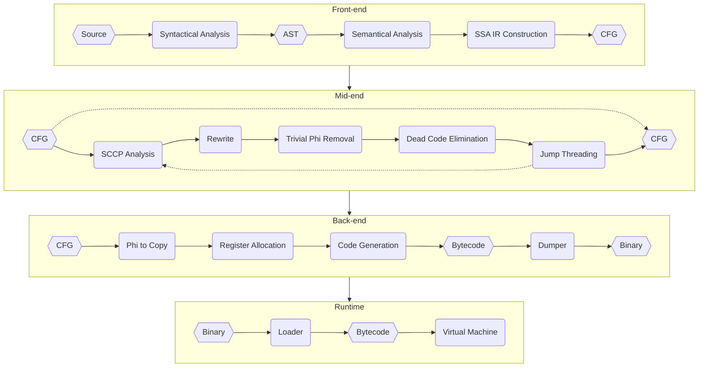

  

  <a href="https://felys.dev/">Documentation</a> |
  <a href="https://exec.felys.dev/">Playground</a> |
  <a href="https://felys.dev/autobiography.html">病者的粉色遐想♪</a>

## What is the Felys Programming Language?

Felys is a dependency-free interpreted programming language written in Rust, featuring its own compiler and runtime. Feel free to try it out in the online [playground](https://exec.felys.dev/). Please note, however, that the language is currently in a fragile state following a major reconstruction and requires project-level refactoring to improve code quality.

## Architecture

I understand that the naming and code organization do not make sense, but I like it.

- [PhiLia093](felys/src/philia093): Parser and a general-purpose [generator](philia093) with self-bootstrapping capabilities
- [Cyrene](felys/src/cyrene): Control-flow graph builder and transformer for intermediate representation
- [Demiurge](felys/src/demiurge): Dead code elimination, register allocation, and code generation
- [Elysia](felys/src/elysia): Execution runtime, featuring a neural network library and bytecode loader/dumper

To balance development speed with performance, Felys introduced a compiler and runtime to replace the original recursive tree-walking interpreter. All objects are immutable for simpler memory management via reference counting. The language embraces a functional paradigm to streamline logic and eliminate null-pointer issues. Dynamic typing is for simplicity and flexibility but rejects weak typing. Here's the high-level pipeline:

Hexagons represent the state of the program at a specific stage. Dotted lines mean an optional path, but not configured in the [playground](https://exec.felys.dev/). Specifically, repeating optimization passes enables deeper optimization, though skipping them is also valid. However, a single pass is the most optimal configuration for most tasks. And yes, lexical analysis does not exist.

## Reading List

The following papers, blogs, and books helped me a lot. Also, ask LLMs.

- [Packrat Parsing: Simple, Powerful, Lazy, Linear Time](https://arxiv.org/abs/cs/0603077)
- [PEG Parsing Series Overview](https://medium.com/@gvanrossum_83706/peg-parsing-series-de5d41b2ed60)
- [Simple and Efficient Construction of Static Single
  Assignment Form](https://c9x.me/compile/bib/braun13cc.pdf)
- [Compilers: Principles, Techniques, and Tools](https://en.wikipedia.org/wiki/Compilers:_Principles,_Techniques,_and_Tools)

## License

Distributed under the terms of the [LICENSE](LICENSE).

## Copyright

© All rights reserved by miHoYo

## Legal Statement

Other properties and any right, title, and interest thereof and therein (intellectual property rights included) not derived from Honkai Impact 3rd and Honkai: Star Rail belong to their respective owners.
